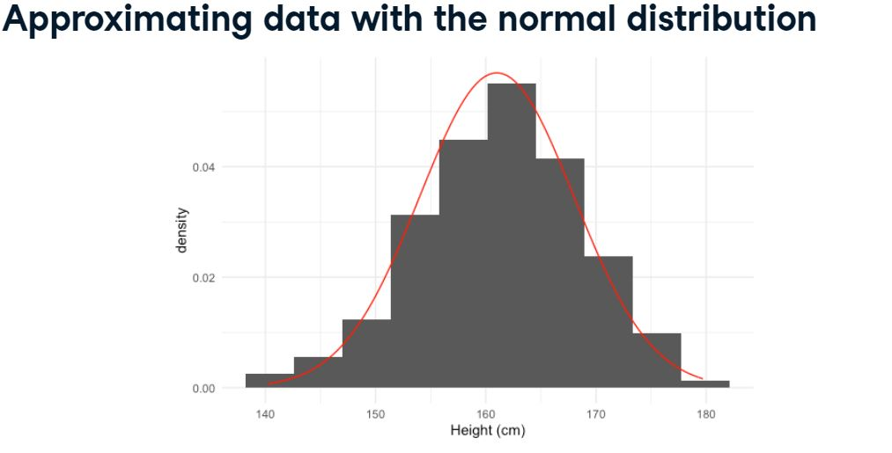
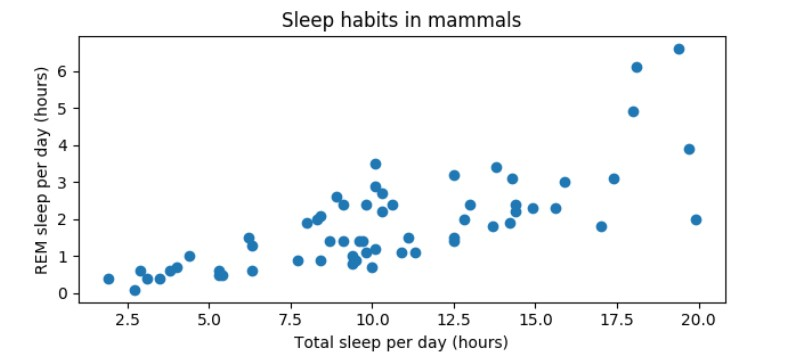
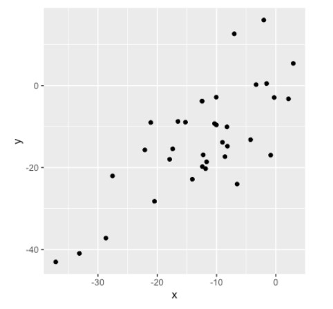

# Python - Introduction to Statistics
Python statistics experimentation for Data Science to collect, analyze, and draw conclusions from data. For example,

## Summary Statistics

Summary statistics including mean, median, and standard deviation

### What is Statistics?

1. What?
    - Statistics - study of collecting and analyzing data.
    - Summary statistics - a fact about or summary of data e.g. mean, sum etc.

2. What can do?
    - what is the likelihood of someone purchasing your product? Are people more likely to purchase if they can use a different payment system?
    - how many calls will your support team receive?
    - how many occupants will your hotel have? how can you optimize occupancy?
    - how many jeans sizes should you manufacture to fit 95% of the population? Should the same number of each size be produced?
    - A/B tests: Which ad is more effective in getting people to purchase a product?

3. Types of Statistics


```bash
Descriptive Examples
--------------------
1. Given data on all 100,000 people who viewed an ad, what percent of people clicked on it?
2. Given data on every customer service request made, what\'s the average time it took to respond?

Inferential Examples
--------------------
1. Given data on 20 fish caught in a lake, what\'s the average weight of all fish in the lake?
2. After interviewing 100 customers, what percent of all your customers are satisfied with your product?
```

4. Types of Data


```bash
Continuous Numeric Examples
--------------------
1. Kilowatts of electricity used
2. Air temperature

Discrete Numeric Examples
--------------------
1. Number of courses taken
2. Number of clicks on an ad
3. Number of items in stock

Categorical Examples
--------------------
1. Brand of a product
2. Zip code
```

5. Categorical data representation as numbers


6. Why data type matters?
    - to know which summary statistics you need to calculate and which visualization will work.
    - e.g. for numerical data: mean can be calculated and scatter plot will work, but same won't work for categorical data. Similarly count and bar plots will not work for numerical data.

### Measures of Center

- check for typical value or center value of data.
- mean, median, mode

Which one to use? 
- mode is mostly used for categorical data
- mean is more sensitive to extreme values and more affected by outliers than median
- so mean works better for symmetrical data
- if data is skewed (not symmetrical), then median is usually better
- In left skewed data, mean is smaller than median; whereas in righ skewed data, mean is greater.

### Measures of Spread

1. Variance
    - Average distance from each data point to the data\'s mean.
    - the higher the variance, the more spread out the data is.
    - unit of variance is squared

```bash
[Lengthy Way]
a. Subtract mean from each data point
    dists = msleep['sleep_total'] - np.mean(msleep['sleep_total'])
    print(dists)

b. Square each distance
    sq_dists = dists ** 2
    print(sq_dists)

c. Sum Squared distances
    sum_sq_dists = np.sum(sq_dists)
    print(sum_sq_dists)

d. Divide by number of data points - 1 
    variance = sum_sq_dists / (83 -1)
    print(variance)

[Efficient Way (One liner)]
np.var(msleep['sleep_total'], ddof=1) => without ddof=1, population variance is calculated instead of sample variance
```

2. Standard Deviation
    - Calculated by taking square root of variance.
    - unit is easy to understand as compared to variance.

```bash
[By taking Square root of variance]
np.sqrt(np.var(msleep['sleep_total'], ddof=1))

[Direct calculating]
np.std(msleep['sleep_total'], ddof=1)
```

3. Mean Absolute Deviation
    - takes the absolute value of the distances to the mean, and then takes the mean of those differences.
    - similar to standard deviation, with some differences.

```bash
dists = msleep['sleep_total'] - mean(msleep$sleep_total)
np.mean(np.abs(dists) )
```

##### SD vs MAD
- SD squares distances, penalizing longer distances more than shorter ones.
- MAD penalizes each distance equally.
- One isn\'t better than the other, but SD is more common than MAD.


4. Quantiles
    - called percentiles
    - split up the data into some number of equal parts.
    - quartiles, quintiles, and deciles, which split up a dataset into 4, 5, and 10 pieces, respectively.

```bash
a. Calculating for single quantile
np.quantile(msleep['sleep_total'], 0.5) => splitting into 50% -> equal to median

b. Calculating for multiple quantile
np.quantile(msleep['sleep_total'], [0, 0.25, 0.5, 0.75, 1]) => splitting into 4 parts -> Quartiles
```

5. Boxplots
    - boxes in box plots represent quartiles
    - split up the data into some number of equal parts.

```bash
import matplotlib.pyplot as plt
plt.boxplot(msleep[ 'sleep_total'])
plt.show()
```


6. Quantiles using np.linspace()

```bash
np.quantile(msleep['sleep_total'], [0, 0.2, 0.4, 0.6, 0.8, 1])
                    
                    or

np.Linspace(start, stop, num) => start value, end value, no. of intervals 
np.quantile(msleep['sleep_total'], np.linspace(0, 1, 5))
```


7. Interquartile range (IQR)
    - distance between the 25th and 75th percentile
    - which is also the height of the box in a boxplot
    - less influenced by Outliers
    - often used to find outliers

```bash
np.quantile(msleep['sleep_total'], 0.75) - np.quantile(msleep['sleep_total'], 0.25)
                    
                    or
                    
from scipy.stats import igqr
igr(msleep['sleep_total'])
```

8. Outliers
    - data point that is substantially different from the others
    - How do we know what a substantial difference is? A data point is an outlier if

```bash
data < Q1 - 1.5 x IQR

        or

data > Q3 + 1.5 x IQR
```

##### Finding Outliers

```bash
from scipy.stats import iqr
iqr = igr(msleep[ 'bodywt'])
Lower_threshold = np.quantile(msleep['bodywt'], 0.25) - 1.5 * iqr
upper_threshold = np.quantile(msleep['bodywt'], 0.75) + 1.5 * iqr
msleep[(msleep['bodywt'] < Lower_threshold) | (msleep['bodywt'] > upper_threshold)]
```

9. All in One go

```bash
msleep[ 'bodywt'].describe()
```

## Random Numbers and Probability

- Generate random samples and measure chance using probability.
- Using the binomial distribution to model events with binary outcomes.

### What are the chances?
- using probability
- between 0 & 1
- 0 means impossible while 100% means will certainly happen, whereas in between are chances
- P(event) = # of ways event can happen / total # of possible outcomes

```bash
1. Sampling from a DataFrame
print(sales_counts)
sales_counts.sample()

2. Setting a random seed (to show sample results)
np.random.seed(10)

3. Sampling without replacement
saLles_counts.sample(2)

4. Sampling with replacement
sales_counts.sample(5, replace = True)
```

##### Independent events
- two events are independent if the probability of the second event isn't affected by the outcome of the first event.
- in general, sampling with replacement is independent
- e.g. flipping a coin 3 times, or rolling a die twice

##### Dependent events
- two events are dependent if the probability of the second event is affected by the outcome of the first event.
- in general, sampling without replacement is dependent
- e.g. from a deck of cards, dealing 3 players 7 cards each, or randomly picking 3 people to work on the weekend from a group of 20 people, or randomly selecting 5 products from the assembly line to test for quality assurance.


### Discrete distributions

#### Probability distribution
- describes the probability of each possible outcome in a scenario
- Expected Value of distribution: mean of probability distribution (calculated by multiplying each value by its probability and summing)
- visualizing a probability distribution by barplot, where each bar represents an outcome, and each bar's height represents the probability of that outcome
- Probability = area => calculate probability of different outcomes by taking areas of the probability distribution.

##### Fair Die
- special discrete distribution called **discrete uniform distribution** => when all outcomes have same probability

```bash
Expected Value = (1 x 1/6) + (2 x 1/6) + (3 x 1/6) + (4 x 1/6) + (5 x 1/6) + (6 x 1/6) = 3.5

P(die roll) <= 2 = ?
```


##### Uneven Die
- die with 2 misprinted as 3

```bash
Expected Value = (1 x 1/6) + (2 x 0) + (3 x 1/3) + (4 x 1/6) + (5 x 1/6) + (6 x 1/6) = 3.67

P(die roll) <= 2 = ?
```


##### Sampling from discrete distributions
- die with 2 misprinted as 3

```bash
1. See probability of fair die 
print (die)

2. Calculate expected value (i.e. mean)
np.mean(die[ 'number'])

3. Sampling 10 times
rolls_10 = die.sample(19, replace = True)
print (rolls_10)

4. Visualizing a sample using histogram
rolls_10[ 'number'].hist(bins=np.linspace(1,7,7))
plt.show()
```


###### Law of Large Number
As the size of your sample increases, the sample mean will approach the expected value.

| Sample Size   | Mean  |
| ------------- | ----- |
| 10            | 3.00  |
| 100           | 3.40  |
| 1000          | 3.48  |

### Continuous distributions

##### Waiting time for bus (bus arrive every 12 mins)
- special continuous distribution called **Continuous uniform distribution** => when all outcomes have same probability
- total area = 1, no matter the shape of distribution


```bash
P(4 <= wait time <= 7) = ?
```


```bash
Uniform Distribution in Python
==============================

1. P(wait time <= 7) = ?
from scipy.stats import uniform
uniform.cdf(7, 0, 12) => Output:0.58, waiting less than 7 mins, between 0 and 12

2. P(wait time >= 7) = 1 - P(wait time <= 7) = ?
from scipy.stats import uniform
1 - uniform.cdf(7, 0, 12) => Output:0.416

3. P(4 <= wait time <= 7) = P(wait time <= 7) - P(wait time <= 4) = ?
from scipy.stats import uniform
uniform.cdf(7, 0, 12) - uniform.cdf(4, 0, 12)

4. P(0 <= wait time <= 12) = 12 * 1/12 = 1
```

```bash
Generate random numbers according to uniform distribution
=========================================================
from scipy.stats import uniform
uniform.rvs(0, 5, size=10) => Generate array of 10 random numbers between 0 and 5
```

##### Other Continuous Distributions


##### Example Comparisons


### The Binomial distribution

##### Coin Flip Example (Fair Coin)
```bash
Flipping a coin
===============

Fromula: binom.rvs(# of coins, probability of success, size= # of trials)
Here size is name argument and must be explicitly defined

from scipy.stats import binom
binom.rvs(1, 0.5, size=1) 
=> Flip 1 coin with 50% chance of success (i.e. head) 1 time
```

```bash
Flipping a coin 8 times
=======================
binom.rvs(1, 0.5, size=8) 
=> Flip 1 coin with 50% chance of success 8 times
=> It will return set of 8 flips of 1 and 0
```

```bash
Many Flips one time
=======================
binom.rvs(8, 0.5, size=1) 
=> Flip 8 coins with 50% chance of success 1 time
=> Output will be 1 number which is total no of successes
```

```bash
Many Flips many times
=======================
binom.rvs(3, 0.5, size=10) 
=> Flip 3 coins with 50% chance of success 10 times
=> Output will be 10 numbers, each representing total no. of heads from each set of flips
```

##### UnFair Coin [Head Probability = 25%]

```bash
binom.rvs(3, 0.25, size=10) 
=> Flip 3 coins with 25% chance of success 10 times
=> Output will be 10 numbers, each representing total no. of heads from each set of flips
=> result has lower no. as compared to 50% chances
```

#### Binomial distribution

- Probability distribution of the number of successes in a sequence of independent trials.
- If trials are not independent, the binomial distribution does not apply. (e.g. without replacement)
- e.g. no of heads in a sequence of coin flips
- described by n & p, where 
- n = total number of trials
- p = probability of success
- Expected value = n*p

```bash
              p        n
binom.rvs(3, 0.5, size=10) 
```


```bash
Find Binomial Distribution probability
======================================
                            n           p
# binom.pmf(num heads, num trials, prob of heads)

1. P(heads = 7) = ?
binom.pmf(7, 10, 0.5) => output: 0.117
=> Flip 10 coins with 50% chance of success, there is about 12% chance that exactly 7 of them will be heads


2. P(heads <= 7) = ?
binom.cdf(7, 10, 0.5) => output: 0.945
=> Getting no. of successess less than or equal to first argument
=> i.e. probability of getting 7 or fewer heads out of 10 coins is about 95%

3. P(heads > 7) = ?
1 - binom.cdf(7, 10, 0.5) => output: 0.054
```

##### Expected Value
Expected value = n*p

```bash
Expected no. of heads out of 10 flips = 10 * 0.5 = 5
```

## More Distributions and the Central Limit Theorem

- One of the most important probability distributions in statistics is normal distribution
- create histograms to plot normal distributions 
- understanding of the central limit theorem
- statistical functions by adding the Poisson, exponential, and t-distributions

### The Normal distribution

- countless statistical methods rely on it
- applies to more real-world situations than the other distributions
- bell like shape

Properties:

- symmetrical
- area beneath the curve is 1
- curve never hits 0, even if it looks like from tail ends in curve (only 0.006% area is contained beyond the edges of the graph)


#### Areas under normal distribution
Sometimes called 68-95-99.7 rule


#### Women Height Example
With mean = 161cm and SD=7cm



```bash
1. What % of women are shorter than 154cm?
from scipy.stats import norm
norm.cdf(154, 161, 7)
               m  SD
```


```bash
2. What % of women are taller than 154cm?
from scipy.stats import norm
1 - norm.cdf(154, 161, 7) => output: 84%
```


```bash
3. What % of women are 154-157cm?
norm.cdf(157, 161, 7) - norm.cdf(154, 161, 7) => output: 12%
```


```bash
Calculate percentiles (reverse of above) [% given, finding values]
========================================
4. What height are 90% of women shorter than?
norm.ppf(0.9, 161, 7) => output: 169.97
```


```bash
5. What height are 90% of women taller than?
norm.ppf((1-0.9), 161, 7) => output: 152.029
=> 90% of women taller than = 10% of women shorter than
```


#### Generate random numbers

```bash
# Generate 10 random heights
          m   SD
norm.rvs(161, 7, size=10) => Generate 10 random heights
```

### The central limit theorem

#### Example - Rolling dice 5 times
```bash
1. Rolling dice 5 times
die = pd.Series([1, 2, 3, 4, 5, 6])
# Roll 5 times
samp_5 = die.sample(5, replace=True)
print (samp_5)

2. Take mean
np.mean(samp_5)

3. Repeat 10 times
sample_means = []
for i in range(10):
    samp_5 = die.sample(5, replace=True)
    sampLe_means.append(np.mean(samp_5) )
print(sample_means)

4. Plot sample means
plt.hist(sampLe_means)
plt.show()
```

A distribution of summary statistics like this is called **sampling distribution** (sampling distribution of the sample mean)

- if we increase intervals, e.g. 100, then shape somewhat resembles the normal distribution, even though distribution of die is uniform.
- if we further increase intervals, e.g. 1000, then shape more resembles the normal distribution.
- this phenomenon is known as the central limit theorem


#### About: The central limit theorem (CLT)

The sampling distribution of a statistics becomes closer to the normal distribution as the number of trials increases.


- samples should be random and independent (e.g. with replacement)
- applies to other summary statistics as well.

##### Standard Deviation and the CLT


```bash
sample_sds = []
for i in range(1000):
    samp_5 = die.sample(5, replace=True)
    sampLe_sds.append(np.std(samp_5) )
print(sampLe_sds)
```

##### Proportions and the CLT

```bash
sales_team = pd.Series(["Amir", "Brian", "Claire", "Damian"])
sales_team.sample(10, replace=True)
```


#### CLT Usage

- This can be a useful method for estimating characteristics of an underlying distribution.
- Also comes in handy, when we have huge population and don't have time or resources to collect data on everyone. Instead we can collect several smaller samples and create a sampling distribution to estimate what the mean or std is.


### The Poisson distribution

#### Poisson processes
- events appear to happen at a certain rate, but completely at random.

- Examples
    - Number of animals adopted from an animal shelter per week
    - Number of people arriving at a restaurant per hour
    - Number of earthquakes in California per year

- Time unit is irrelevant, as long as you see the same unit when talking about the same situation.

#### Poisson distribution
- probability of some # of events occuring over a fixed period of time.
- CLT applies here.

- Examples
    - P >= 5 of animals adopted from an animal shelter per week
    - P == 12 of people arriving at a restaurant per hour
    - P < 20 earthquakes in California per year

- Described by lambda λ.
- λ = average no. of events per time interval = expected value
    - average no. of adoption per week = 8 


- λ changes the shape of the distribution, so a Poisson distribution with lambda 1 in blue, looks quite different than a Poisson distribution with lambda 8 in green.


```bash
Probability of a single value
=============================
1. If average no. of adoption per week is 8. What is P(no. of adoptions in a week == 5)?
from scipy.stats import poisson
poisson.pmf(5, 8) => output: 0.09

2. If average no. of adoption per week is 8. What is P(no. of adoptions in a week <= 5)?
from scipy.stats import poisson
poisson.cdf(5, 8) => output: 0.19

3. If average no. of adoption per week is 8. What is P(no. of adoptions in a week > 5)?
from scipy.stats import poisson
1 - poisson.cdf(5, 8) => output: 0.80

4. If average no. of adoption per week is 10. What is P(no. of adoptions in a week > 5)?
from scipy.stats import poisson
1 - poisson.cdf(5, 10) => output: 0.93
```

#### Sampling / Generate random numbers

```bash
# Simulate 10 different weeks
            m   
poisson.rvs(8, size=10) => Generate 10 random numbers
```

### More Probability Distributions

#### Exponential Distribution
- probability of time between Poisson events.

- Examples
    - P > 1 day between adoptions
    - P < 10 mins between restaurant arrivals
    - P of 6-8 months between earthquakes

- like Poisson, the time unit does not matter as long as its consistent
- also uses lambda λ (rate)
- continuous unlike Poisson, since it represents time 

##### Example - Customer Service Request
- on average, one customer service ticket is created every 2 minutes
- rephrasing in terms of time interval of 1 minute
    - λ = 0.5 customer service tickets created each minute

- exponential distribution with rate = 0.5 looks like below:


- rate effects shape of the distribution, and how steeply it declines.


##### Example Comparison with Poisson, Binomial


```bash
Expected Value of Exponential Distribution
==========================================
(In Poisson) [in terms of rate]
expected value = measures the frequency in terms of rate or number of events.
i.e. λ = 0.5 requests per minute

(In Exponential) [in terms of time]
expected value = measures the frequency in terms of time between events.
i.e. 1/λ = 1 request per 2 minutes
```

```bash
How long until a new request is created?
========================================

1. P(wait < 1min) = ?
from scipy.stats import expon
expon.cdf(1, scale=0.5) => output: 0.86

2. P(wait > 3mins) = ?
from scipy.stats import expon
1 - expon.cdf(3, scale=0.5) => output: 0.002

3. P(1min < wait < 3mins) = ?
from scipy.stats import expon
expon.cdf(3, scale=0.5) - expon.cdf(1, scale=0.5) => output: 0.13
```

#### t-Distribution
- sometimes also called Student's t-distribution.
- similar shape as normal distribution, but not quite same.
- comparing with normal distribution, t-distribution tails are thicker (means in t-distribution, observations are more likely to fall further from the mean).


- has parameters **degree of freedom (df)** which affects the thickness of tails.
- lower df = thicker tails, higher standard deviations
- higher df = closer to normal distributions.


#### log-normal Distribution
- variables whose logarithm is normally distributed.
- resulting in distributions that are skewed, unlike the normal distribution.

- Examples
    - length of chess games
    - adult blood pressure
    - no. of hospitalizations in the 2003 SARS outbreak.


## Correlation and Experimental Design

- Quantify the strength of a linear relationship between two variables
- explore how confounding variables can affect the relationship between two other variables
- how a study’s design can influence its results, change how the data should be analyzed, and potentially affect the reliability of your conclusions.

### Relationship between two variables

- relationship between two variables can be visualized using scatter plots
- x = explanatory / independent variable
- y = response / dependent variable



### Correlation

- relationship between two numeric variables can be also examine using a number called correlation coefficient.
- quantifis the linear relationship between two variables.
- Number between -1 and 1.
- magnitude corresponds to the strength of the relationship.
- sign (+/-) corresponds to the direction of the relationship.

#### Correlation Magnitude = Strength

##### Example 1 - [correlation coefficient = 0.99]

- data points are closely clustered around a line
- near perfect / very strong relationship
- if we know x, we will have pretty good idea what value of y could be.


##### Example 2 - [correlation coefficient = 0.75]

- data points are a bit more spread out
- strong relationship



##### Example 3 - [correlation coefficient = 0.56]

- moderate relationship


##### Example 4 - [correlation coefficient = 0.21]

- weak relationship


##### Example 5 - [correlation coefficient = 0.04]

- near to 0
- no Relationship
- scatterplot looks completely random.
- knowing value of x, doesn't tell about value of y.


#### Correlation Sign = Direction

- +0.75 indicates as x increases, y increases
- -0.75 indicates as x increases, y decreases


#### Visualizing Relationships

- use package seaborn : plotting pacakge built on top of matplotlib for two variable relationship

```bash
1. View Plot
import seaborn as sns
sns.scatterplot(x="sleep_total", y="sleep_rem", data=msleep)
plt.show()

2. Adding a trend line (helpful to more easily see relationship)
import seaborn as sns
sns.lmplot(x="sleep_total", y="sleep_rem", data=msleep, ci=None)
plt.show()
# ci = None => means no confidence interval margins around the line

3. Compute correlation coefficient between two series 
msleep["sleep_total"].corr(msleep["sleep_rem"])
                    or
msleep["sleep_rem"].corr(msleep["sleep_total"])
# same value between x & y or y & x
```

- there are many ways to calculate correlation
- method above used is known as Pearson product-moment correlation method (r) 
- Most common method having formula:


- Other variations of this foruml
    -  Kendall's tau
    -  Spearman's rho

### Correlation caveats

- while correlation is a useful way to quantify relationships, there are some caveats.
    - it measures strength of linear relationships only.
    - so should not be used blindly, and always data should by visualized first.


#### 1. Calculate Correlation for Non-linear
- When variables have skewed distributions, they often require a transformation in order to form a linear relationship with another variable so that correlation can be computed.
- so transform data first to make it linear

##### Example - Mammal's body weight vs awake time

```bash
msleep["bodywt"].corr(msleep["awake"]) => output: 0.31
```
- data is highly skewed, which shows weak relationship (incorrectly)


- when data is highly skewed, apply **log transformation**
- calculate log of bodywt and plot graph with logValue
- data will look more linear then regular and calculate correct relationship

```bash
msleep['log_bodywt'] = np.log(msleep['bodywt'])
sns.Lmplot(x='Log_bodywt' , y='awake', data=msleep, ci=None)
plt.show()

msleep["log_bodywt"].corr(msleep["awake"]) => output: 0.56
```


##### Other transformations
1. Log transformation (log(x))
2. square root transformation (sqrt(x))
3. reciprocal transformation (1 /x)

Choice of transformation depends on the data and how skewed it is.
- Can be applied in different combinations to x and y. 
- e.g. log(x) and log(y) or sqrt(x) and 1/y

##### Why use a transformation?
- Certain statistical methods rely on variables having a linear relationship. 
- - Correlation coefficient
- - Linear regression

#### 2. Correlation does not imply causation

- means x is correlated with y, does not mean x causes y.
- e.g. If relation between **per capita margarine consumption vs divorce rate** is nearly perfect, then it does not mean consuming more margarine will cause more divorces.
- this kind of correlation is often called a spurious correlation (A pheonmenon called **confounding** can lead to spurious correlation).

##### Example - To illustrate confounding

- confounder or lurking variable is actual cause of correlation
- and if it is assosiated with another variable, it represent other variables relationship as a spurious correlation. 


### Design of experiments

Often, data is created as a result of a study that aims to answer a specific question. However, data needs to be analyzed and interpreted differently depending on how the data was generated and how the study was designed.

#### Vocabulary

Experiments aim to answer : "What is the effect of the treatment on the response?" 

- treatment : explanatory or independent variable 
- response : response or dependent variable. 

For example, what is the effect of an advertisement on the number of products purchased? 

- treatment = advertisement, 
- response = number of products purchased.

#### Controlled experiments
1. In a controlled experiment, participants are randomly assigned to either the treatment group or the control group.
    - treatment group receives the treatment
    - control group does not. 

For example an A/B test. 

- treatment group will see an advertisement,
- control group will not. 

2. Groups should be comparable so that causation can be inferred; means we can determine if seeing an advertisement causes people to buy more. 

3. If the groups aren't comparable, this could lead to confounding, or bias. 
    - If the average age of participants in the treatment group is 25,
    - the average age of participants in the control group is 50, 
    - then age could be a potential **confounder** if younger people are more likely to purchase more, and this will make the experiment biased towards the treatment.

#### The gold standard of experiments will use...
The gold standard, or ideal experiment, will eliminate as much bias as possible by using certain tools. 

1. Randomized controlled trial. 
    - participants are randomly assigned to the treatment or control group and their assignment isn't based on anything other than chance [no other characteristics]. 
    - Random assignment like this helps ensure that the groups are comparable. 

2. Placebo
    - resembles the treatment, but has no effect. 
    - participants don't know if they're in the treatment or control group. 
    - This ensures that the effect of the treatment is due to the treatment itself, not the idea of getting the treatment. 
    - This is common in clinical trials that test the effectiveness of a drug. The control group will still be given a pill, but it's a sugar pill that has minimal effects on the response.


3. Double-blind experiment
    - the person administering the treatment or running the experiment also doesn't know whether they're administering the actual treatment or the placebo. 
    - prevent bias in the response as well as the analysis of the results. 

These different tools all boil down to the same principle: 
**fewer opportunities for bias to creep into your experiment =  the more reliably you can conclude about causation (whether the treatment affects the response)**

#### Observational studies
The other kind of study is the observational study. 

1. participants are not randomly assigned to groups. 
    - participants assign themselves, usually based on pre-existing characteristics. 

2. Useful for answering research questions that aren't conducive to a controlled experiment. 
    - For example, if we want to study the effect of smoking on cancer, we can't force people to start smoking. 
    - Similarly, if we want to study how past purchasing behavior affects whether someone will buy a product, we can't force people to have certain past purchasing behavior. 

3. Because assignment isn't random, there's no way to guarantee that the groups will be comparable in every aspect, so observational studies can't establish causation, only association. 
    - effects of the treatment may be confounded by factors that got certain people into the control group and certain people into the treatment group. 
    - there are ways to control for confounders, which can help strengthen the reliability of conclusions about association.

#### Longitudinal vs. cross-sectional studies

1. longitudinal study
    - the same participants are followed over a period of time to examine the effect of treatment on the response. 
    - Effect of age on height is not confounded by generation.
    - more expensive, and take longer to perform

2. cross-sectional study 
    - data is collected from a single snapshot in time. 
    - Effect of age on height is confounded by generation. 
    - cheaper, faster, and more convenient.

